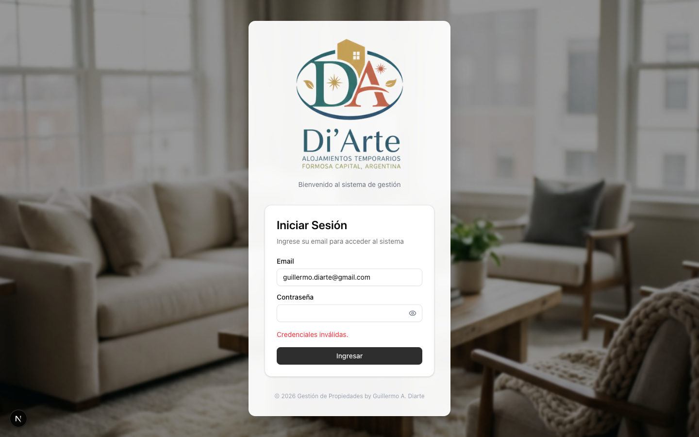
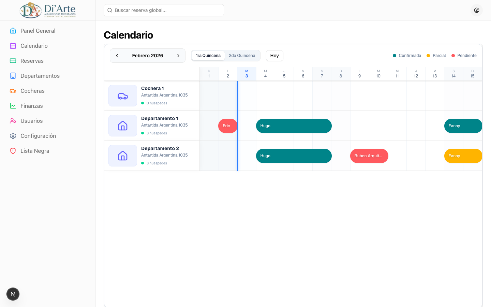
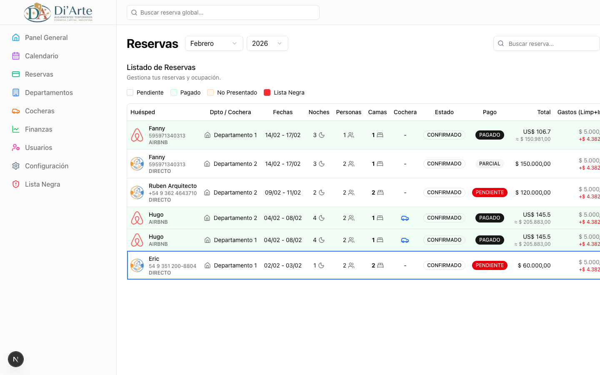
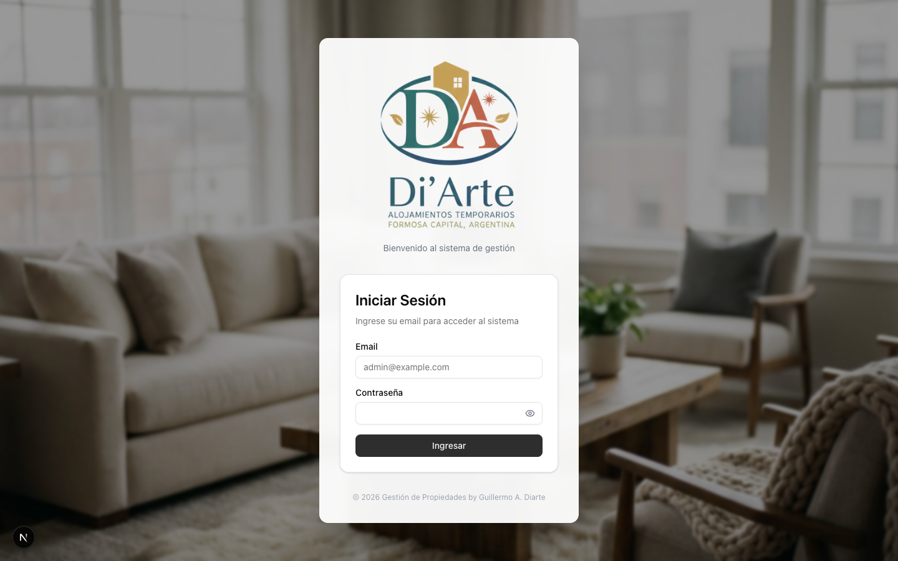
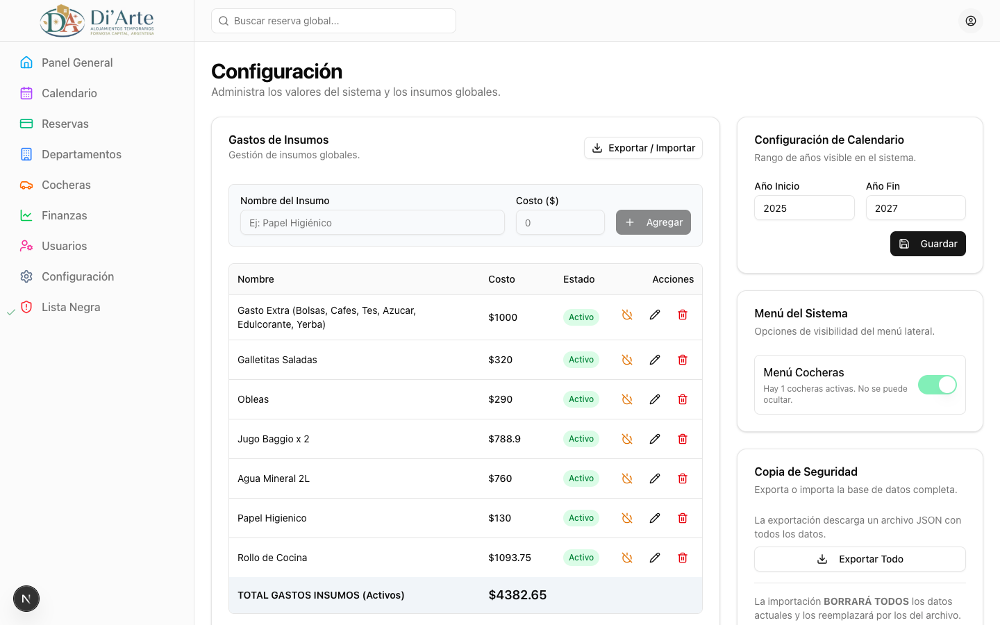

# Alojamientos Di'Arte CRM

**[English]**
A comprehensive Customer Relationship Management (CRM) system designed for managing temporary apartment rentals. This application streamlines the management of reservations, departments, finances, and guest history, providing a centralized platform for efficient property administration.

**[Español]**
Un sistema de Gestión de Relaciones con Clientes (CRM) integral diseñado para administrar alquileres temporarios de departamentos. Esta aplicación agiliza la gestión de reservas, departamentos, finanzas e historial de huéspedes, proporcionando una plataforma centralizada para una administración eficiente de propiedades.

---

## 🚀 Features / Características

| Feature | Description (English) | Descripción (Español) |
| :--- | :--- | :--- |
| **Reservations** | Full management of bookings (Tentative, Confirmed, Cancelled, No-Show) with calendar integration. | Gestión completa de reservas (Tentativa, Confirmada, Cancelada, No-Show) con integración de calendario. |
| **Departments** | Manage property details, capacity, and amenities. | Administra detalles de propiedades, capacidad y comodidades. |
| **Finance** | Track income, expenses (cleaning, commissions), and generate financial reports. | Rastrea ingresos, gastos (limpieza, comisiones) y genera reportes financieros. |
| **Calendar** | Visual monthly and daily views of occupancy and availability. | Vistas visuales mensuales y diarias de ocupación y disponibilidad. |
| **Blacklist** | Security feature to track and flag problematic guests. | Función de seguridad para rastrear y marcar huéspedes problemáticos. |
| **User Mgmt** | Role-based access control (Admin/Visualizer) with strict security policies. | Control de acceso basado en roles (Admin/Visualizador) con políticas de seguridad estrictas. |

## 📸 Screenshots / Capturas de Pantalla

### Dashboard / Panel General


### Calendar / Calendario


### Reservations / Reservas


### Departments / Departamentos


### Settings / Configuración



## 🛠️ Tech Stack / Tecnologías

- **Framework:** [Next.js 15+ (App Router)](https://nextjs.org/)
- **Database:** [SQLite](https://www.sqlite.org/) (via [Prisma ORM](https://www.prisma.io/))
- **Styling:** [Tailwind CSS](https://tailwindcss.com/) & [Shadcn/UI](https://ui.shadcn.com/)
- **Authentication:** [NextAuth.js (Beta)](https://authjs.dev/)
- **Language:** TypeScript
- **Validation:** Zod & React Hook Form

## ⚙️ Installation / Instalación

### Prerequisites / Requisitos Previos
- Node.js (v18 or higher)
- npm or yarn

### Steps / Pasos

1.  **Clone the repository / Clonar el repositorio:**
    ```bash
    git clone https://github.com/your-username/crm-app.git
    cd crm-app
    ```

2.  **Install dependencies / Instalar dependencias:**
    ```bash
    npm install
    # or
    yarn install
    ```

3.  **Environment Variables / Variables de Entorno:**
    Create a `.env` file in the root directory. / Crea un archivo `.env` en la raíz.
    ```env
    DATABASE_URL="file:./dev.db"
    AUTH_SECRET="your-super-secret-key-min-32-chars"
    ```

4.  **Database Setup / Configuración de Base de Datos:**
    ```bash
    # Generate Prisma Client
    npx prisma generate

    # Push schema to database (Creates dev.db)
    npx prisma db push

    # (Optional) Seed initial data
    # npx prisma db seed
    ```

5.  **Run Development Server / Iniciar Servidor de Desarrollo:**
    ```bash
    npm run dev
    ```

    Open [http://localhost:3000](http://localhost:3000) in your browser.

## 🔐 Security / Seguridad

- **Passwords:** Updates require a strong password (min 8 chars, 1 uppercase, 1 lowercase, 1 number, 1 special char).
- **Access:** Only authenticated users can access dashboard routes.
- **Roles:** Specific actions (User management, Global settings) are restricted to `ADMIN` role.

---

© 2026 Alojamientos Di'Arte. Created by Guillermo A. Diarte.
